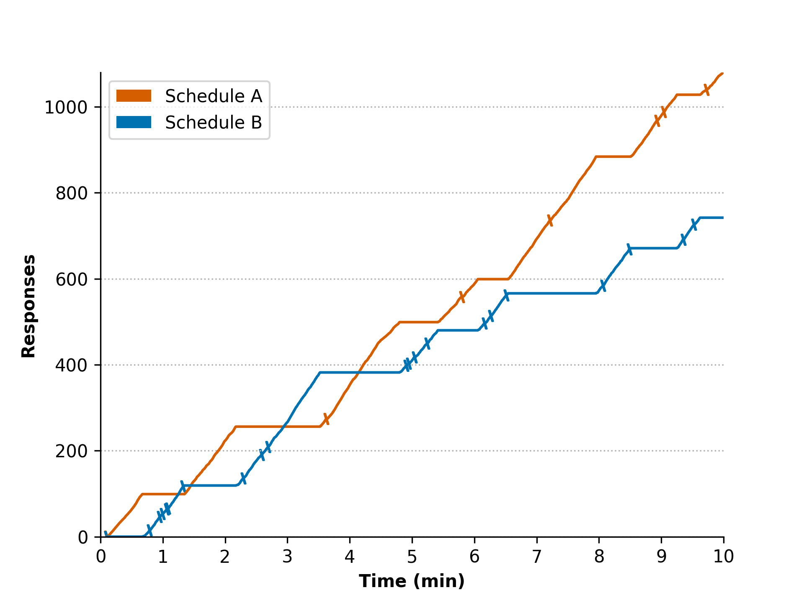
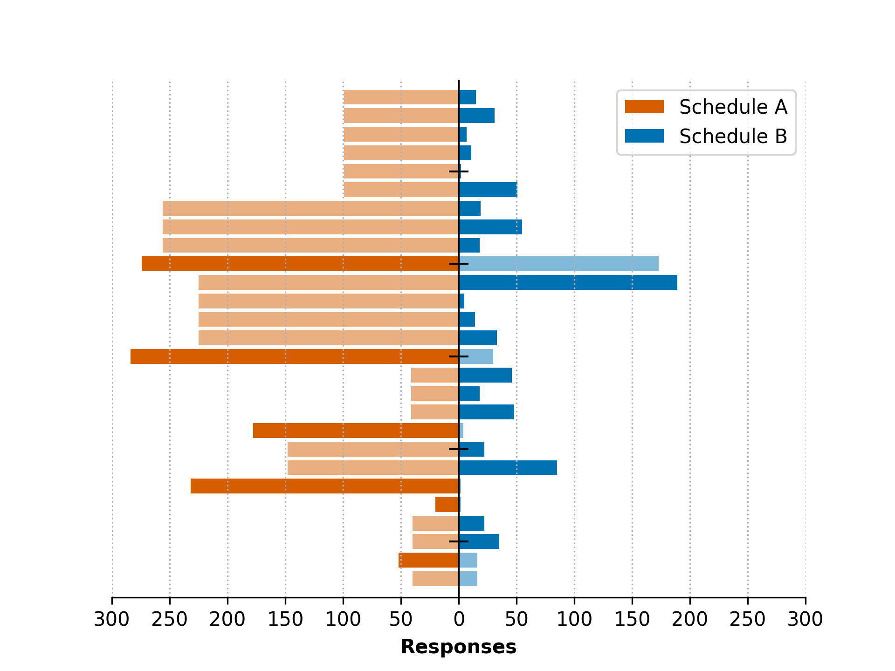

# concurrent-schedules-plot

[](https://github.com/alvaroviudez/concurrent_schedules_plot/actions/workflows/ci.yml)
[](LICENSE)

A command-line tool and Python library to analyze and plot data from concurrent reinforcement schedules. It takes a raw session CSV with cumulative response and reinforcement counts and produces two standard visualizations used in behavior analysis research: a cumulative record and a back-to-back bar plot.

## What are concurrent schedules?

In behavior analysis, a *concurrent schedule* is an experimental setup where a subject can choose between two (or more) response options at the same time, each delivering reinforcement according to its own rule — for example, pressing button A vs. button B, where each button pays out on a different, independent schedule. This is the standard paradigm for studying choice: instead of asking "does behavior increase when reinforced," it asks "how does behavior *distribute* between two available options, and how does that distribution track the relative value of each one." The classic finding here is the [matching law](https://doi.org/10.1901/jeab.1961.4-267) (Herrnstein, 1961): relative response rate tends to match relative reinforcement rate.

This package works with data from any concurrent-schedule task where responses and reinforcers are logged as running (cumulative) counts over time for two options — regardless of the specific software used to run the experiment. It expects the data already exported to CSV; it does not talk to any particular experiment-runner software.

For an example of this kind of task and the type of question it is used to answer, see [Viúdez et al. (2022)](https://doi.org/10.1016/j.beproc.2022.104698).

## Installation

*New to Python, Git or the command line? There's a step-by-step guide with no assumed background at the end of this file: [For researchers with no coding background](#for-researchers-with-no-coding-background).*

```bash
git clone https://github.com/alvaroviudez/concurrent_schedules_plot.git
cd concurrent_schedules_plot
pip install -e .
```

Requires Python 3.10+.

## Usage

The tool expects a CSV with cumulative counts of responses and reinforcers for two schedules (A and B), plus a timestamp column. The canonical column names are `time_ms, resp_a, resp_b, reinf_a, reinf_b`:

```bash
cs-plot session.csv --time-unit ms
```

If your data uses different column names or a different delimiter, map them explicitly:

```bash
cs-plot session.csv \
  --sep ";" \
  --time-col current_time \
  --resp-a-col resp_left \
  --resp-b-col resp_right \
  --reinf-a-col reinf_left \
  --reinf-b-col reinf_right \
  --time-unit s
```

`--time-unit` is required and must be one of `ms`, `s`, `min` — this is deliberate: rather than silently assuming milliseconds, the tool forces you to check your own data first.

Full options:

```bash
cs-plot --help
```

### Output

Running `cs-plot` produces four files in the output directory (`output/` by default):

| File | Description |
|---|---|
| `<prefix>_cumulative.<fmt>` | Cumulative record plot |
| `<prefix>_back_to_back_bar.<fmt>` | Back-to-back bar plot, trial by trial |
| `<prefix>_filtered.csv` | Raw data, renamed to the canonical schema |
| `<prefix>_trials.csv` | Trial-by-trial responses and reinforcement flags |

**Cumulative record** — running total of responses over time for both schedules, with reinforcement deliveries marked by tick marks on each line:



**Back-to-back bar plot** — one row per inter-reinforcement interval, schedule A extending left and schedule B extending right. Each bar is the number of responses emitted on that schedule *since that schedule was last reinforced*. Full color means the interval closed with a reinforcer on that schedule; the lighter shade means the interval was still open at that point:



*Figures generated from real experimental data, published in Viúdez et al. (2022), Behavioural Processes, https://doi.org/10.1016/j.beproc.2022.104698.*

### Why two plots?

The two figures answer different questions, and the package produces both because neither covers the other's blind spot.

The **cumulative record** has been the canonical display in the experimental analysis of behavior since Ferster & Skinner (1957). Time is a real, continuous axis, so the slope of each line *is* the response rate: flat stretches are pauses, steep stretches are bursts, and a change in the gap between the two lines shows when allocation shifted during the session. What it shows poorly is how many responses a given reinforcer actually cost. Reading that off the plot means visually subtracting two y-values that sit far from the axis and far from each other — a length judgment without a common baseline, which is among the least accurate elementary perceptual tasks, and one that degrades further as the compared objects get farther apart (Cleveland & McGill, 1984).

The **back-to-back bar plot** trades the time axis away to get exactly that back. Every bar starts from a shared zero baseline, so response counts are read against a common scale, and the A-vs-B comparison within a row is immediate rather than inferred. Reinforcement status is encoded on the bar itself through color saturation, so responding and its consequence are co-located instead of split between a line and a separate tick mark. The cost is that time becomes ordinal: rows are evenly spaced no matter how long each interval actually lasted, so response *rate* cannot be recovered from this plot, and within-interval structure such as pausing is invisible.

In short, the cumulative record shows *when* and *how fast*; the back-to-back bar plot shows *how much*, and at what cost per reinforcer. The back-to-back layout itself is a long-established encoding (it is the same construction as a population pyramid); what this package does is apply it to concurrent-schedule data with reinforcement status carried by the bars.

### References

> Cleveland, W. S., & McGill, R. (1984). Graphical Perception: Theory, Experimentation, and Application to the Development of Graphical Methods. *Journal of the American Statistical Association*, 79(387), 531–554. https://doi.org/10.1080/01621459.1984.10478080
>
> Ferster, C. B., & Skinner, B. F. (1957). *Schedules of Reinforcement*. Appleton-Century-Crofts.
>
> Herrnstein, R. J. (1961). Relative and absolute strength of response as a function of frequency of reinforcement. *Journal of the Experimental Analysis of Behavior*, 4(3), 267–272. https://doi.org/10.1901/jeab.1961.4-267
>
> Viúdez, Á., Keating, J., Arantes, J., & Martinez, H. (2022). Instructional Control in Choice Tasks: the Relation between Type of Schedule and Relative Expected Values. *Behavioural Processes*, 200, 104698. https://doi.org/10.1016/j.beproc.2022.104698

## Project structure

```
concurrent_schedules_plot/
├── .github/workflows/ci.yml         # CI: ruff + pytest on every push
├── assets/                          # figures used in this README
├── src/concurrent_schedules_plot/
│   ├── cs_plot.py                   # core: data preparation and plotting
│   ├── pipeline.py                  # orchestration: CSV in, files out
│   └── cli.py                       # command-line interface
├── tests/
│   ├── baseline/                    # reference images for pytest-mpl
│   ├── data/                        # handwritten CSV fixtures
│   ├── test_prepare_data.py
│   ├── test_plots.py
│   ├── test_pipeline.py
│   └── test_cli.py
├── LICENSE
├── pyproject.toml
└── README.md
```

## Development

```bash
pip install -e ".[dev]"
pytest --mpl
ruff check .
```

Plot tests use [pytest-mpl](https://github.com/matplotlib/pytest-mpl): each figure is rendered and compared pixel-wise against a reference image in `tests/baseline/`, so unintended changes to plot output fail the test suite rather than passing silently. The `--mpl` flag enables that comparison; without it the plot tests only check that the figures build without error.

## Data

This package ships only with small, handwritten CSV fixtures for testing (`tests/data/`) — no real experimental data is included or distributed. The figures shown above were generated from data collected for the author's doctoral thesis; the underlying dataset is not published, in line with the confidentiality terms of the original participant consent.

## License

MIT — see [LICENSE](LICENSE).

---

## For researchers with no coding background

This section is for anyone who wants to run this tool but has never used Python, Git, or a terminal before. It assumes nothing. If you already know what a terminal is, you don't need to read this — go back to [Installation](#installation).

### What you'll need

- A computer (Windows, Mac, or Linux).
- About 15 minutes.

### Step 1: Install Python

Python is the programming language this tool is written in. You need it installed on your computer first.

- Go to [python.org/downloads](https://www.python.org/downloads/) and click the big download button for your operating system.
- Run the installer. **On Windows, make sure to check the box that says "Add Python to PATH"** before clicking Install — this step is easy to miss and causes problems later if skipped.

### Step 2: Open a terminal

The *terminal* (also called "command line" or "command prompt") is a program where you type text commands instead of clicking icons. It's already installed on your computer.

- **Windows**: click the Start menu, type `PowerShell`, press Enter.
- **Mac**: press `Cmd + Space`, type `Terminal`, press Enter.

A black or white window with a blinking cursor will open. That's the terminal. You type a command and press Enter to run it.

### Step 3: Download this project

You have two options.

**Option A (easier, no Git needed):** go to the [project page](https://github.com/alvaroviudez/concurrent_schedules_plot), click the green **Code** button, then **Download ZIP**. Unzip it somewhere you'll remember, like your Desktop.

**Option B (if you want to learn Git):** in the terminal, type:

```bash
git clone https://github.com/alvaroviudez/concurrent_schedules_plot.git
```

and press Enter. This downloads the project into a new folder. (This requires Git to be installed — if the command gives an error, use Option A instead.)

### Step 4: Move into the project folder

In the terminal, type `cd ` (with a space after it) followed by the path to the folder you just downloaded, and press Enter. For example, if you unzipped it to your Desktop:

```bash
cd Desktop/concurrent_schedules_plot-main
```

`cd` means "change directory" — it tells the terminal which folder to work in.

### Step 5: Install the tool

Type this and press Enter:

```bash
pip install -e .
```

This reads the project's setup file and installs everything it needs. It may take a minute and print a lot of text — that's normal. If it finishes without a red "error" message, it worked.

### Step 6: Run it on your data

You need a CSV file (a spreadsheet saved in plain-text format — you can create one by saving an Excel or Google Sheets file as "CSV") with your session data.

The simplest case — if your file has columns named exactly `time_ms, resp_a, resp_b, reinf_a, reinf_b` — type:

```bash
cs-plot your_file.csv --time-unit ms
```

replacing `your_file.csv` with the actual name of your file (if it's not in the same folder as the project, type the full path to it instead).

If your columns are named differently, or your time is in seconds instead of milliseconds, see the [Usage](#usage) section above for how to tell the tool which column is which.

### Step 7: Find your results

After running the command, look for a new folder called `output` inside the project folder. It will contain two images (the plots) and two CSV files (the processed data). Open the images like you would open any picture file.

### If something goes wrong

Copy the exact error message the terminal shows you, and either open an [issue on GitHub](https://github.com/alvaroviudez/concurrent_schedules_plot/issues) or send it to whoever pointed you to this tool.
